# 🚀 NextRole AI: Your Autonomous Career Assistant

**NextRole AI** is an intelligent, multi-agent system designed to take the friction out of the job search. It autonomously scans your Gmail for application updates, classifies them, extracts key data, and presents everything in a sleek dashboard and real-time Telegram alerts—all while keeping your PII (Personally Identifiable Information) secure.

---

## ✨ Key Features

- 🕵️ **Multi-Agent Orchestration**: A pipeline of specialized AI agents (Classifier, Career Tracker, Privacy, Execution) that work together to understand your emails.
- 🔒 **Privacy-First Design**: Sensitive data like OTPs and passwords are sent directly to you via Telegram and redacted before any long-term memory storage.
- 📬 **Smart Ingestion**: Automatically fetches and processes emails from your connected Gmail accounts.
- 📊 **Real-time Dashboard**: A high-density Next.js web interface to track application statuses, interview dates, and scan progress.
- 🤖 **Telegram Integration**: Receive instant alerts for important updates and manage your assistant via simple chat commands.
- 🧠 **Hybrid Memory**: Combines Relational DB (SQLite) for structured data and Vector DB (ChromaDB) for semantic email recall.

---

## 🏗️ Architecture

```mermaid
graph TD
    A[Gmail API] -->|New Emails| B[FastAPI Backend]
    B --> C{Orchestrator}
    C --> D[Privacy Agent]
    D -->|Redacted Content| E[Vector Memory]
    C --> F[Classifier Agent]
    F -->|Job Updates| G[Career Tracker Agent]
    G -->|Structured Data| H[Relational DB]
    C --> I[Telegram Bot]
    I -->|Alerts/Commands| J[User]
    K[Next.js Dashboard] -->|Fetch Data| B
```



---

## 🛠️ Technology Stack

### Backend
- **Framework**: [FastAPI](https://fastapi.tiangolo.com/)
- **Orchestration**: Custom Agentic Pipeline (LangChain inspired)
- **Database**: [SQLite](https://www.sqlite.org/) (Structured) & [ChromaDB](https://www.trychroma.com/) (Vector)
- **Integrations**: [Gmail API](https://developers.google.com/gmail/api), [Telegram Bot API](https://core.telegram.org/bots/api)
- **Security**: AES Encryption for OAuth tokens, PII Redaction for Vector storage.

### Frontend
- **Framework**: [Next.js 14+](https://nextjs.org/) (App Router)
- **Language**: [TypeScript](https://www.typescriptlang.org/)
- **Styling**: Vanilla CSS (High-density design)

---

## 🚀 Quick Start

### 1. Prerequisites
- Python 3.11+
- Node.js 18+
- [ngrok](https://ngrok.com/) (for local webhook testing)

### 2. Backend Setup
1. Navigate to the backend folder:
   ```bash
   cd backend
   ```
2. Create and activate a virtual environment:
   ```bash
   python -m venv .venv
   source .venv/bin/activate  # Linux/macOS
   # OR
   .\.venv\Scripts\activate   # Windows
   ```
3. Install dependencies:
   ```bash
   pip install -r requirements.txt
   ```
4. Create a `.env` file from `.env.example` and fill in your credentials.

### 3. Frontend Setup
1. Navigate to the frontend folder:
   ```bash
   cd frontend
   ```
2. Install dependencies:
   ```bash
   npm install
   ```
3. Run the development server:
   ```bash
   npm run dev
   ```

---

## ⚙️ Configuration Checklist

To fully enable the system, you need:
- [ ] **Telegram Bot**: Created via [@BotFather](https://t.me/botfather).
- [ ] **Google Cloud Project**: With Gmail API enabled and OAuth 2.0 credentials.
- [ ] **Ngrok URL**: To route Telegram and Google webhooks to your local machine.

*For detailed connection steps, see [setup_guide.md](file:///c:/Users/arumu/Documents/Projects/2026/Email-AI-System/setup_guide.md).*

---

## 🧪 Development & Testing

NextRole AI includes specialized endpoints for manual testing (requires `ENVIRONMENT=dev`):

- `POST /dev/ingest`: Trigger a manual scan for connected Gmail accounts.
- `POST /dev/digest`: Force an immediate summary digest to Telegram.
- `GET /health`: Basic system check.

---

## 📁 Repository Layout

```text
.
├── backend/        # FastAPI, AI Agents, DB migrations
├── frontend/       # Next.js 14 Dashboard
├── docs/           # Project documentation
├── nextrole.db     # Local SQLite database (auto-generated)
└── start.bat       # One-click startup script (Windows)
```

---

*Built with ❤️ for job seekers.*
